Geog6300: Lab 6
================

## Regression \#reference class day 11/14/2024

\#univariate regression \#multivariate regression \#

``` r
library(sf)
library(tidyverse)
library(knitr)
library(tmap)

library(car)
library(lmtest)
library(Hmisc)
library(sjPlot)
library(corrplot)
```

**Overview:** This lab focuses on regression techniques. You’ll be
analyzing the association of various physical and climatological
characteristics in Australia with observations of several animals
recorded on the citizen science app iNaturalist.

\###Data and research questions###

Let’s import the dataset.

``` r
lab6_data<-st_read("data/aus_climate_inat.gpkg")
```

    ## Reading layer `aus_climate_inat' from data source 
    ##   `C:\Users\sonri\UGA\Grad School\DataScienceGeog4300\TestProject2\geog4-6300-lab-6-SonrisaR-1\data\aus_climate_inat.gpkg' 
    ##   using driver `GPKG'
    ## Simple feature collection with 716 features and 22 fields
    ## Geometry type: POLYGON
    ## Dimension:     XY
    ## Bounding box:  xmin: 113.875 ymin: -43.38632 xmax: 153.375 ymax: -11.92074
    ## Geodetic CRS:  WGS 84 (CRS84)

The dataset for this lab is a 1 decimal degree hexagon grid that has
aggregate statistics for a number of variables:

- ndvi: NDVI/vegetation index values from Landsat data (via Google Earth
  Engine). These values range from -1 to 1, with higher values
  indicating more vegetation.
- maxtemp_00/20_med: Median maximum temperature (C) in 2000 or 2020
  (data from SILO/Queensland government)
- mintemp_00/20_med: Median minimum temperature (C) in 2020 or 2020
  (data from SILO/Queensland government)
- rain_00/20_sum: Total rainfall (mm) in 2000 or 2020 (data from
  SILO/Queensland government)
- pop_00/20: Total population in 2000 or 2020 (data from NASA’s Gridded
  Population of the World)
- water_00/20_pct: Percentage of land covered by water at some point
  during the year in 2000 or 2020
- elev_med: Median elevation (meters) (data from the Shuttle Radar
  Topography Mission/NASA)

There are also observation counts from iNaturalist for several
distinctively Australian animal species: the central bearded dragon, the
common emu, the red kangaroo, the agile wallaby, the laughing
kookaburra, the wombat, the koala, and the platypus.

Our primary research question is how the climatological/physical
variables in our dataset are predictive of the NDVI value. We will build
models for 2020 as well as the change from 2000 to 2020. The second is
referred to as a “first difference” model and can sometimes be more
useful for identifying causal mechanisms.

\###Part 1: Analysis of 2020 data###

We will start by looking at data for 2020.

**Question 1** *Create histograms for NDVI, max temp., min temp., rain,
and population, and water in 2020 as well as elevation. Based on these
graphs, assess the normality of these variables.*

``` r
#Code goes here.
kable(head(lab6_data))
```

| grid_id | maxtemp_00_med | maxtemp_20_med | mintemp_00_med | mintemp_20_med | rain_00_sum | rain_20_sum | ndvi_00_med | ndvi_20_med | water_00_pct | water_20_pct |     pop_00 |     pop_20 | elev_med | Central.Bearded.Dragon | Common.emu | Red.kangaroo | Agile.wallaby | Laughing.kookaburra | Wombat | Koala | Platypus | geom                         |
|:--------|---------------:|---------------:|---------------:|---------------:|------------:|------------:|------------:|------------:|-------------:|-------------:|-----------:|-----------:|---------:|-----------------------:|-----------:|-------------:|--------------:|--------------------:|-------:|------:|---------:|:-----------------------------|
| G92     |         31.100 |         31.700 |         17.200 |         18.500 |    175386.8 |     40084.8 |    0.284045 |   0.1830391 |    0.0358597 |    0.0040025 |   38.39824 |   51.43013 |       70 |                      0 |          1 |            1 |             0 |                   0 |      0 |     0 |        0 | POLYGON ((114.375 -24.33377… |
| G110    |         26.500 |         27.200 |         12.750 |         14.025 |    127536.9 |     89407.1 |    0.000000 |   0.0000000 |    0.0090753 |    0.0044911 | 1882.98616 | 2521.62865 |        0 |                      0 |          1 |            0 |             0 |                   0 |      0 |     0 |        0 | POLYGON ((114.875 -28.66389… |
| G111    |         28.900 |         29.850 |         15.025 |         16.450 |    121836.5 |     51763.4 |    0.283010 |   0.2225348 |    0.0049098 |    0.0029087 |   76.31120 |  102.19668 |      167 |                      0 |          6 |            0 |             0 |                   0 |      0 |     0 |        0 | POLYGON ((114.875 -26.93184… |
| G112    |         30.650 |         31.200 |         16.700 |         18.000 |    159591.0 |     44964.7 |    0.252225 |   0.1921783 |    0.0163824 |    0.0139623 |   30.85762 |   41.32482 |      161 |                      0 |          1 |            0 |             0 |                   0 |      0 |     0 |        0 | POLYGON ((114.875 -25.19979… |
| G113    |         32.825 |         33.500 |         17.350 |         18.750 |    205212.8 |     53343.0 |    0.256260 |   0.1932478 |    0.0227352 |    0.0077956 |  198.27375 |  265.75401 |       80 |                      0 |          2 |            0 |             0 |                   0 |      0 |     0 |        0 | POLYGON ((114.875 -23.46774… |
| G129    |         26.800 |         27.375 |         12.200 |         13.150 |    114236.1 |    110501.4 |    0.000000 |   0.0000000 |    0.0034076 |    0.0050880 | 3184.40681 | 4266.20747 |        0 |                      0 |          9 |            0 |             0 |                   0 |      0 |     0 |        0 | POLYGON ((115.375 -29.52992… |

``` r
#hist(lab6_data) #error
colnames(lab6_data)
```

    ##  [1] "grid_id"                "maxtemp_00_med"         "maxtemp_20_med"        
    ##  [4] "mintemp_00_med"         "mintemp_20_med"         "rain_00_sum"           
    ##  [7] "rain_20_sum"            "ndvi_00_med"            "ndvi_20_med"           
    ## [10] "water_00_pct"           "water_20_pct"           "pop_00"                
    ## [13] "pop_20"                 "elev_med"               "Central.Bearded.Dragon"
    ## [16] "Common.emu"             "Red.kangaroo"           "Agile.wallaby"         
    ## [19] "Laughing.kookaburra"    "Wombat"                 "Koala"                 
    ## [22] "Platypus"               "geom"

``` r
lab6_data_numeric <- lab6_data %>%
  select(ndvi_20_med, maxtemp_20_med, mintemp_20_med, rain_20_sum, pop_20, water_20_pct, elev_med) #make sure numeric #ndvi does not exist as a column.

#lab6_data_numeric <- lab6_data %>%
  #select(ndvi_20_med, maxtemp_00_20_med, mintemp_00_20_med, rain_00_20_sum, pop_00_20, water_00_20_pct, elev_med) #make sure numeric #ndvi does not exist as a column.

#NDVI 2020
hist(lab6_data_numeric$ndvi_20_med)  #skewed
```

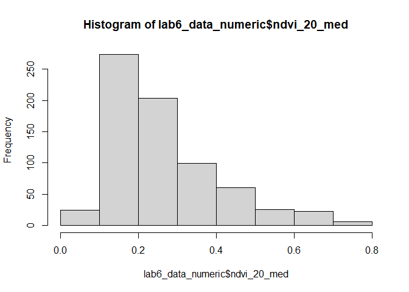<!-- -->

``` r
#Max Temp 2020
hist(lab6_data_numeric$maxtemp_20_med) #skewed
```

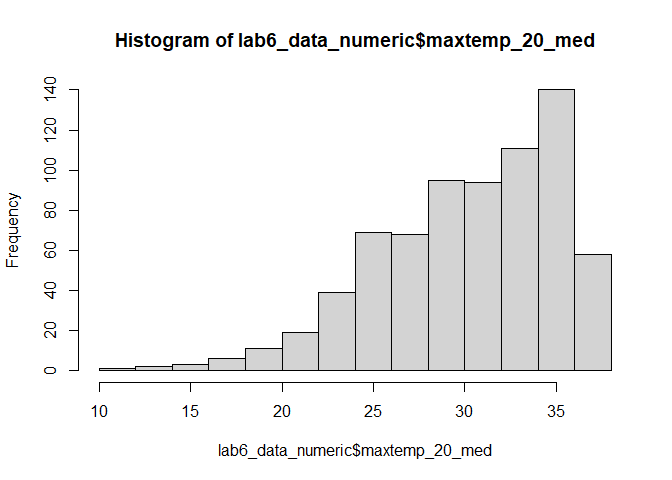<!-- -->

``` r
#Min Temperature 2020
hist(lab6_data_numeric$mintemp_20_med) #skewed
```

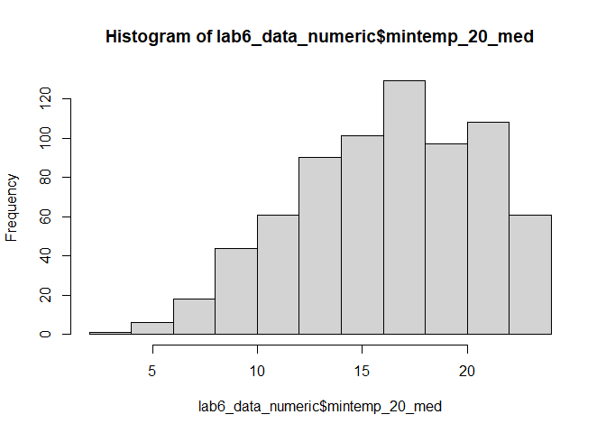<!-- -->

``` r
#Rain 2020
hist(lab6_data_numeric$rain_20_sum) #skewed
```

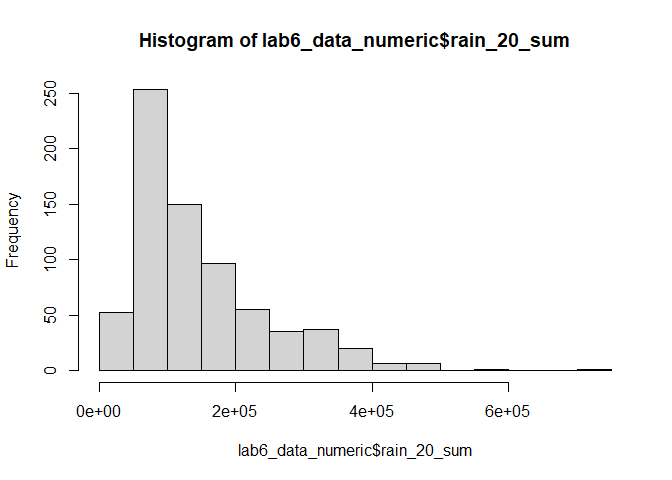<!-- -->

``` r
# Population 2020
hist(lab6_data_numeric$pop_20) #skewed
```

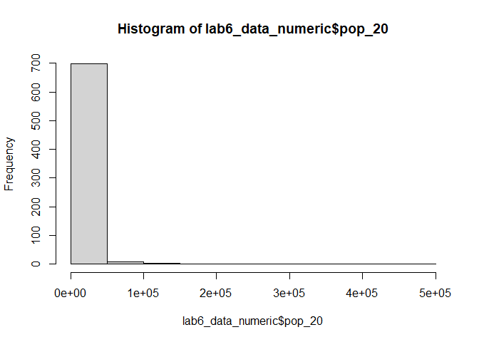<!-- -->

``` r
# Water Percentage 2020
hist(lab6_data_numeric$water_20_pct) #skewed
```

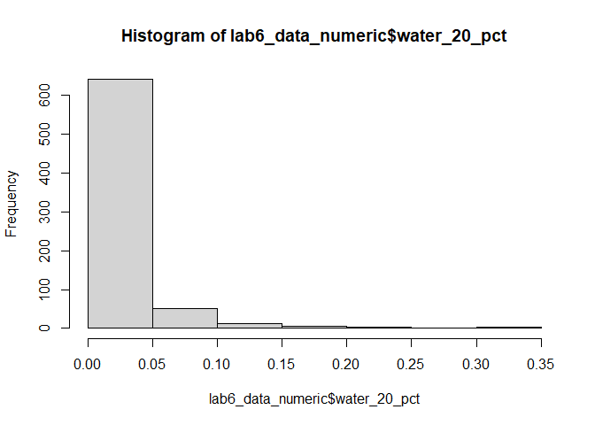<!-- -->

``` r
# Elevation
hist(lab6_data_numeric$elev_med) #skewed
```

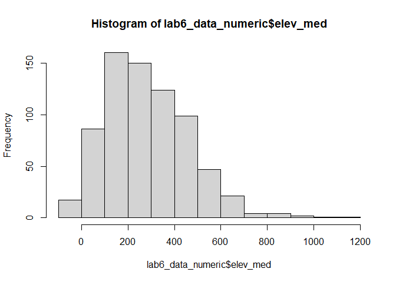<!-- -->

{All of these variables look skewed (not normally distributed) based on
their histograms.}

**Question 2** *Use tmap to map these same variables using Jenks natural
breaks as the classification method. For an extra challenge, use
`tmap_arrange` to plot all maps in a single figure.*

``` r
map_ndvi <- tm_shape(lab6_data) + # error correction - whole sf object needed to be passed in to tm_shape
  tm_borders() +  
  tm_fill("ndvi_20_med" , style = "jenks") #needed to specify the variable for the color, in this case "ndvi_20_med"

map_maxT <- tm_shape(lab6_data) + 
  tm_borders() +  
  tm_fill("maxtemp_20_med" , style = "jenks") 

map_minT <- tm_shape(lab6_data) + 
  tm_borders() +  
  tm_fill("mintemp_20_med" , style = "jenks")

map_rain <- tm_shape(lab6_data) + 
  tm_borders() +  
  tm_fill("rain_20_sum" , style = "jenks")

map_pop <- tm_shape(lab6_data) + 
  tm_borders() +  
  tm_fill("pop_20" , style = "jenks")

map_wat <- tm_shape(lab6_data) + 
  tm_borders() +  
  tm_fill("water_20_pct" , style = "jenks")

map_elev <- tm_shape(lab6_data) + 
  tm_borders() +  
  tm_fill("elev_med" , style = "jenks")


tmap_arrange(map_ndvi, map_maxT, map_minT, map_rain, map_pop, map_wat, map_elev )
```

    ## Variable(s) "elev_med" contains positive and negative values, so midpoint is set to 0. Set midpoint = NA to show the full spectrum of the color palette.

    ## Legend labels were too wide. The labels have been resized to 0.56, 0.56, 0.56, 0.56, 0.56. Increase legend.width (argument of tm_layout) to make the legend wider and therefore the labels larger.
    ## Legend labels were too wide. The labels have been resized to 0.56, 0.56, 0.56, 0.56, 0.56. Increase legend.width (argument of tm_layout) to make the legend wider and therefore the labels larger.

    ## Legend labels were too wide. The labels have been resized to 0.48, 0.44, 0.41, 0.41, 0.41. Increase legend.width (argument of tm_layout) to make the legend wider and therefore the labels larger.

    ## Some legend labels were too wide. These labels have been resized to 0.48, 0.44, 0.41, 0.41. Increase legend.width (argument of tm_layout) to make the legend wider and therefore the labels larger.

    ## Legend labels were too wide. The labels have been resized to 0.56, 0.56, 0.56, 0.56, 0.56. Increase legend.width (argument of tm_layout) to make the legend wider and therefore the labels larger.

    ## Variable(s) "elev_med" contains positive and negative values, so midpoint is set to 0. Set midpoint = NA to show the full spectrum of the color palette.

    ## Some legend labels were too wide. These labels have been resized to 0.64. Increase legend.width (argument of tm_layout) to make the legend wider and therefore the labels larger.

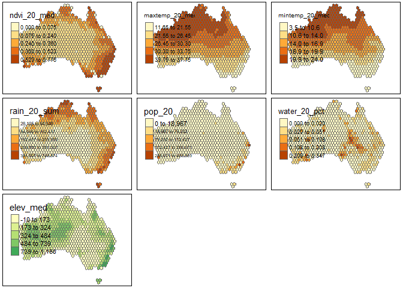<!-- -->

**Question 3** *Based on the maps from question 3, summarise major
patterns you see in the spatial distribution of these data from any of
your variables of interest. How do they appear to be associated with the
NDVI variable?*

{Rainfall is concentrated along the north and western coasts which
matches the pattern of the NDVI.}

**Question 4** *Create univariate models for each of the variables
listed in question 1, with NDVI in 2020 as the dependent variable. Print
a summary of each model. Write a summary of those results that indicates
the direction, magnitude, and significance for each model coefficient.*

``` r
mod_maxT<-lm(ndvi_20_med~maxtemp_20_med,data=lab6_data)
mod_minT<-lm(ndvi_20_med~mintemp_20_med,data=lab6_data)
mod_rain<-lm(ndvi_20_med~rain_20_sum,data=lab6_data)

mod_pop<-lm(ndvi_20_med~pop_20,data=lab6_data)
mod_wat<-lm(ndvi_20_med~water_20_pct,data=lab6_data)
mod_elev<-lm(ndvi_20_med~elev_med,data=lab6_data)


summary(mod_maxT)
```

    ## 
    ## Call:
    ## lm(formula = ndvi_20_med ~ maxtemp_20_med, data = lab6_data)
    ## 
    ## Residuals:
    ##      Min       1Q   Median       3Q      Max 
    ## -0.41874 -0.07657 -0.01927  0.06833  0.36382 
    ## 
    ## Coefficients:
    ##                  Estimate Std. Error t value Pr(>|t|)    
    ## (Intercept)     0.6612389  0.0294372   22.46   <2e-16 ***
    ## maxtemp_20_med -0.0130902  0.0009601  -13.63   <2e-16 ***
    ## ---
    ## Signif. codes:  0 '***' 0.001 '**' 0.01 '*' 0.05 '.' 0.1 ' ' 1
    ## 
    ## Residual standard error: 0.1251 on 714 degrees of freedom
    ## Multiple R-squared:  0.2066, Adjusted R-squared:  0.2055 
    ## F-statistic: 185.9 on 1 and 714 DF,  p-value: < 2.2e-16

``` r
summary(mod_minT)
```

    ## 
    ## Call:
    ## lm(formula = ndvi_20_med ~ mintemp_20_med, data = lab6_data)
    ## 
    ## Residuals:
    ##      Min       1Q   Median       3Q      Max 
    ## -0.36375 -0.08418 -0.03047  0.06972  0.40383 
    ## 
    ## Coefficients:
    ##                 Estimate Std. Error t value Pr(>|t|)    
    ## (Intercept)     0.464461   0.018997   24.45   <2e-16 ***
    ## mintemp_20_med -0.012282   0.001131  -10.86   <2e-16 ***
    ## ---
    ## Signif. codes:  0 '***' 0.001 '**' 0.01 '*' 0.05 '.' 0.1 ' ' 1
    ## 
    ## Residual standard error: 0.1301 on 714 degrees of freedom
    ## Multiple R-squared:  0.1418, Adjusted R-squared:  0.1406 
    ## F-statistic:   118 on 1 and 714 DF,  p-value: < 2.2e-16

``` r
summary(mod_rain)
```

    ## 
    ## Call:
    ## lm(formula = ndvi_20_med ~ rain_20_sum, data = lab6_data)
    ## 
    ## Residuals:
    ##      Min       1Q   Median       3Q      Max 
    ## -0.56681 -0.04753 -0.01210  0.04599  0.30930 
    ## 
    ## Coefficients:
    ##              Estimate Std. Error t value Pr(>|t|)    
    ## (Intercept) 1.303e-01  7.060e-03   18.45   <2e-16 ***
    ## rain_20_sum 9.124e-07  3.953e-08   23.08   <2e-16 ***
    ## ---
    ## Signif. codes:  0 '***' 0.001 '**' 0.01 '*' 0.05 '.' 0.1 ' ' 1
    ## 
    ## Residual standard error: 0.1063 on 714 degrees of freedom
    ## Multiple R-squared:  0.4273, Adjusted R-squared:  0.4265 
    ## F-statistic: 532.6 on 1 and 714 DF,  p-value: < 2.2e-16

``` r
summary(mod_pop)
```

    ## 
    ## Call:
    ## lm(formula = ndvi_20_med ~ pop_20, data = lab6_data)
    ## 
    ## Residuals:
    ##      Min       1Q   Median       3Q      Max 
    ## -0.47003 -0.07883 -0.03949  0.06384  0.48974 
    ## 
    ## Coefficients:
    ##              Estimate Std. Error t value Pr(>|t|)    
    ## (Intercept) 2.552e-01  5.013e-03  50.902   <2e-16 ***
    ## pop_20      1.500e-06  1.500e-07   9.998   <2e-16 ***
    ## ---
    ## Signif. codes:  0 '***' 0.001 '**' 0.01 '*' 0.05 '.' 0.1 ' ' 1
    ## 
    ## Residual standard error: 0.1316 on 714 degrees of freedom
    ## Multiple R-squared:  0.1228, Adjusted R-squared:  0.1216 
    ## F-statistic: 99.97 on 1 and 714 DF,  p-value: < 2.2e-16

``` r
summary(mod_wat)
```

    ## 
    ## Call:
    ## lm(formula = ndvi_20_med ~ water_20_pct, data = lab6_data)
    ## 
    ## Residuals:
    ##      Min       1Q   Median       3Q      Max 
    ## -0.26898 -0.08838 -0.04838  0.06871  0.50911 
    ## 
    ## Coefficients:
    ##               Estimate Std. Error t value Pr(>|t|)    
    ## (Intercept)   0.268988   0.006287  42.781   <2e-16 ***
    ## water_20_pct -0.178263   0.154480  -1.154    0.249    
    ## ---
    ## Signif. codes:  0 '***' 0.001 '**' 0.01 '*' 0.05 '.' 0.1 ' ' 1
    ## 
    ## Residual standard error: 0.1403 on 714 degrees of freedom
    ## Multiple R-squared:  0.001862,   Adjusted R-squared:  0.0004636 
    ## F-statistic: 1.332 on 1 and 714 DF,  p-value: 0.2489

``` r
summary(mod_elev)
```

    ## 
    ## Call:
    ## lm(formula = ndvi_20_med ~ elev_med, data = lab6_data)
    ## 
    ## Residuals:
    ##      Min       1Q   Median       3Q      Max 
    ## -0.27082 -0.09585 -0.04270  0.07954  0.44272 
    ## 
    ## Coefficients:
    ##              Estimate Std. Error t value Pr(>|t|)    
    ## (Intercept) 2.138e-01  9.741e-03  21.952  < 2e-16 ***
    ## elev_med    1.787e-04  2.895e-05   6.171 1.14e-09 ***
    ## ---
    ## Signif. codes:  0 '***' 0.001 '**' 0.01 '*' 0.05 '.' 0.1 ' ' 1
    ## 
    ## Residual standard error: 0.1369 on 714 degrees of freedom
    ## Multiple R-squared:  0.05064,    Adjusted R-squared:  0.04931 
    ## F-statistic: 38.08 on 1 and 714 DF,  p-value: 1.136e-09

{As elevation increases by 1 unit, the NDVI increases by 1.787e-04 which
is a significant relationship As the watercover increases by 1 unit, the
NDVI decreases by -0.178263 which is not a significant relationship As
the population increases by 1 unit, the NDVI increases by 1.500e-06
which is a significant relationship but less significant than the other
factors. As rain fall increases by 1 unit, the NDVI increases by
9.124e-07 which is a significant relationship As mintemp increases by 1
unit, the NDVI decreases by -0.012282 which is a significant
relationship As maxtemp increases by 1 unit, the NDVI decreases by
-0.0130902 which is a significant relationship}

**Question 5** *Create a multivariate regression model with the
variables of interest, choosing EITHER max or min temperature (but not
both) You may also choose to leave out any variables that were
insignificant in Q4. Use the univariate models as your guide. Call the
results.*

``` r
model_all<-lm(ndvi_20_med~maxtemp_20_med + rain_20_sum + pop_20 + elev_med,data=lab6_data)
summary(model_all)
```

    ## 
    ## Call:
    ## lm(formula = ndvi_20_med ~ maxtemp_20_med + rain_20_sum + pop_20 + 
    ##     elev_med, data = lab6_data)
    ## 
    ## Residuals:
    ##      Min       1Q   Median       3Q      Max 
    ## -0.50217 -0.02838  0.00409  0.03919  0.20570 
    ## 
    ## Coefficients:
    ##                  Estimate Std. Error t value Pr(>|t|)    
    ## (Intercept)     4.571e-01  2.194e-02  20.828  < 2e-16 ***
    ## maxtemp_20_med -1.170e-02  6.796e-04 -17.220  < 2e-16 ***
    ## rain_20_sum     8.469e-07  3.263e-08  25.953  < 2e-16 ***
    ## pop_20          2.862e-07  1.044e-07   2.741  0.00627 ** 
    ## elev_med        1.233e-04  1.796e-05   6.864 1.46e-11 ***
    ## ---
    ## Signif. codes:  0 '***' 0.001 '**' 0.01 '*' 0.05 '.' 0.1 ' ' 1
    ## 
    ## Residual standard error: 0.0845 on 711 degrees of freedom
    ## Multiple R-squared:  0.6397, Adjusted R-squared:  0.6376 
    ## F-statistic: 315.5 on 4 and 711 DF,  p-value: < 2.2e-16

**Question 6** *Summarize the results of the multivariate model. What
are the direction, magnitude, and significance of each coefficient? How
did it change from the univariate models you created in Q4 (if at all)?
What do the R2 and F-statistic values tell you about overall model fit?*

{As elevation increases by 1 unit, the NDVI increases by 1.233e-04 which
is lower then the univariate result of 1.787e-04 and both are
significant relationships As the population increases by 1 unit, the
NDVI increases by 2.862e-07 which is higher than the univariate result
of 1.500e-06 and both are significant relationships but with two “stars”
so less significant that the other factors. As rain fall increases by 1
unit, the NDVI increases by 8.469e-07 which is lower than the univariate
result of 9.124e-07 and both are significant relationships As maxtemp
increases by 1 unit, the NDVI decreases by -1.170e-02 which is higher in
magnitude than -0.0130902 and both are significant relationships

The F-statistic is an analysis of variance and it indicates whether or
not the r2 is significant. The adjusted R2 is 0.6376 (so 63% of the
change in NDVI is explained by the variables in question) and the
f-statistic is 315.5 which is a high value so it indicates that the r2
is reliable. Based on these results, this model is a good “fit” meaning
that the independent variables do a good job of explaining the change in
NDVI. }

**Question 7** *Use a histogram and a map to assess the normality of
residuals and any spatial autocorrelation. Summarise any notable
patterns that you see.*

``` r
lab6_data$residuals<-residuals(model_all)

hist(lab6_data$residuals)
```

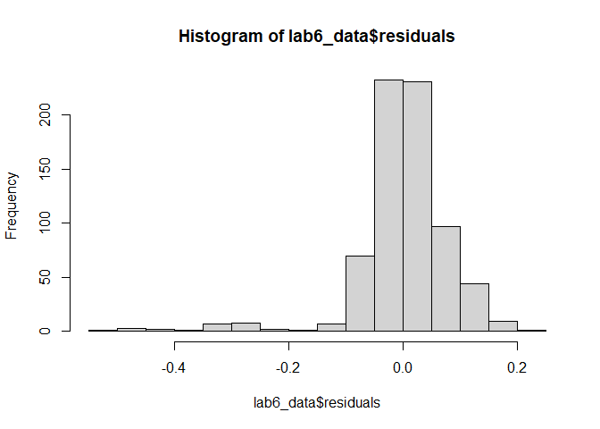<!-- -->

``` r
map_res <- tm_shape(lab6_data) + 
  tm_borders() +  
  tm_fill("residuals" , style = "jenks")
map_res 
```

    ## Variable(s) "residuals" contains positive and negative values, so midpoint is set to 0. Set midpoint = NA to show the full spectrum of the color palette.

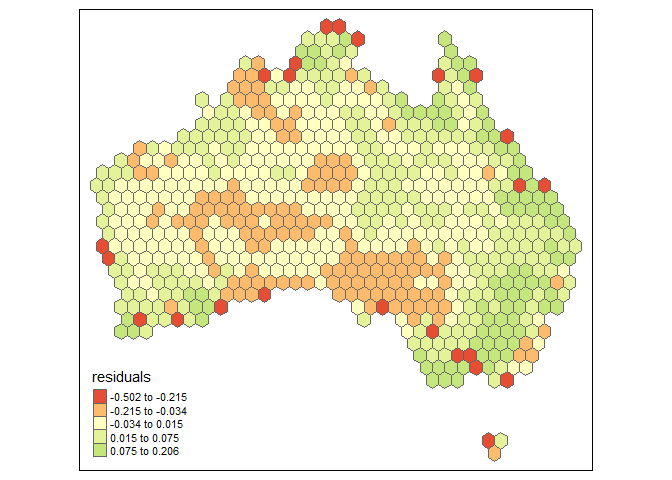<!-- -->

{the most notable residuals (most extreme) seemed scattered allong the
coast}

**Question 8** *Assess any issues with multicollinearity or
heteroskedastity in this model using the techniques shown in class. Run
the appropriate tests and explain what their results show you.*

``` r
vif(model_all) #the value should be under 5 for low multicollinearity.
```

    ## maxtemp_20_med    rain_20_sum         pop_20       elev_med 
    ##       1.098705       1.078449       1.173863       1.009305

``` r
bptest(model_all) #skibbity heteroskedasticity # if the p-value is significant, I would reject the null that the data is NOT.
```

    ## 
    ##  studentized Breusch-Pagan test
    ## 
    ## data:  model_all
    ## BP = 122.21, df = 4, p-value < 2.2e-16

{The vif value was under 5 so I do not suspect high multicollinearity.
The P value is significant at p-value \< 2.2e-16, so I reject the null
hypothesis and conclude that the data is heteroskedastic}

**Question 9** *How would you summarise the results of this model in a
sentence or two? In addition, looking at the full model and your
diagnostics, do you feel this is a model that provides meaningful
results? Explain your answer.*

``` r
#In summary, the results of this model indicate that rainfall, Population and elevation have a positive impact on the increase of NDVI and max temperature has a negative relationship with NDVI. The model that I created which omits mintemp and watercover, is only somewhat changed from the full model, also, low multicolinearity was indicated so I would tend to trust this model to provide meaningful results. 
```

**Disclosure of assistance:** *Besides class materials, what other
sources of assistance did you use while completing this lab? These can
include input from classmates, relevant material identified through web
searches (e.g., Stack Overflow), or assistance from ChatGPT or other AI
tools. How did these sources support your own learning in completing
this lab?*

{A fellow student helped me debug question 4. Chatgpt helped me debug
adding new columns in the challenge question. I couldn’t remember where
in the class material we talked about R2 is 0.6376 and the f-statistic
so I looked that up onlilne and in our textbook}

**Lab reflection:** *How do you feel about the work you did on this lab?
Was it easy, moderate, or hard? What were the biggest things you learned
by completing it?*

{I felt good about my work on this lab and gaining more comptency in R.
It was a moderately hard lab and it was pretty. I REALLY appreciated
using some climate data! The univariate versus multivariate analysis was
particularly useful to help interpret, compare and cement an
understanidng of these types of regression modeling. }

**Challenge question**

\#Option 1 Create a first difference model. To do that, subtract the
values in 2000 from the values in 2020 for each variable for which that
is appropriate. Then create a new model similar to the one you created
in question 5, but using these new variables showing the *change in
values* over time. Call the results of the model, and interpret the
results in the same ways you did above. Also chart and map the residuals
to assess model error. Finally, write a short section that summarises
what, if anything, this model tells you.

``` r
#model_all_New<-lm(ndvi_20_med-ndvi_00_med~maxtemp_20_med + rain_20_sum,data=lab6_data) do the subtraction seperately and rename!
#summary(model_all)

dif1_NDVI<-(lab6_data$ndvi_20_med-lab6_data$ndvi_00_med)
dif1_maxt<-(lab6_data$maxtemp_20_med-lab6_data$maxtemp_00_med)
dif1_mint<-(lab6_data$mintemp_20_med-lab6_data$mintemp_00_med)
dif1_rain<-(lab6_data$rain_20_sum-lab6_data$rain_00_sum)
dif1_pop<-(lab6_data$pop_20-lab6_data$pop_00)
dif1_wat<-(lab6_data$water_20_pct-lab6_data$water_00_pct)

#dif1_NDVI
#dif1_maxt
#dif1_mint
#dif1_rain
#dif1_pop
#dif1_wat

Model_all_dif1<-lm(dif1_NDVI~dif1_maxt + dif1_mint + dif1_rain + dif1_pop + dif1_wat, data=lab6_data)
summary(Model_all_dif1)
```

    ## 
    ## Call:
    ## lm(formula = dif1_NDVI ~ dif1_maxt + dif1_mint + dif1_rain + 
    ##     dif1_pop + dif1_wat, data = lab6_data)
    ## 
    ## Residuals:
    ##      Min       1Q   Median       3Q      Max 
    ## -0.56948 -0.02068  0.00079  0.02271  0.45407 
    ## 
    ## Coefficients:
    ##               Estimate Std. Error t value Pr(>|t|)    
    ## (Intercept) -2.152e-02  4.291e-03  -5.016 6.69e-07 ***
    ## dif1_maxt    2.142e-03  2.489e-03   0.861     0.39    
    ## dif1_mint   -1.266e-02  2.809e-03  -4.506 7.74e-06 ***
    ## dif1_rain    2.180e-07  3.878e-08   5.622 2.71e-08 ***
    ## dif1_pop    -1.424e-07  2.868e-07  -0.496     0.62    
    ## dif1_wat    -1.959e-02  8.618e-02  -0.227     0.82    
    ## ---
    ## Signif. codes:  0 '***' 0.001 '**' 0.01 '*' 0.05 '.' 0.1 ' ' 1
    ## 
    ## Residual standard error: 0.06052 on 710 degrees of freedom
    ## Multiple R-squared:  0.1061, Adjusted R-squared:  0.09985 
    ## F-statistic: 16.86 on 5 and 710 DF,  p-value: 9.076e-16

``` r
#according to the first difference model, if correctly done, the only significant coefficients were the difference in rain and difference in min temp. I think this means that the other coefficients did not have significant change between 2000 and 2020. According to The min temp in 2000 was 

#NDVI first difference
hist(dif1_NDVI)  #fairly normal looking
```

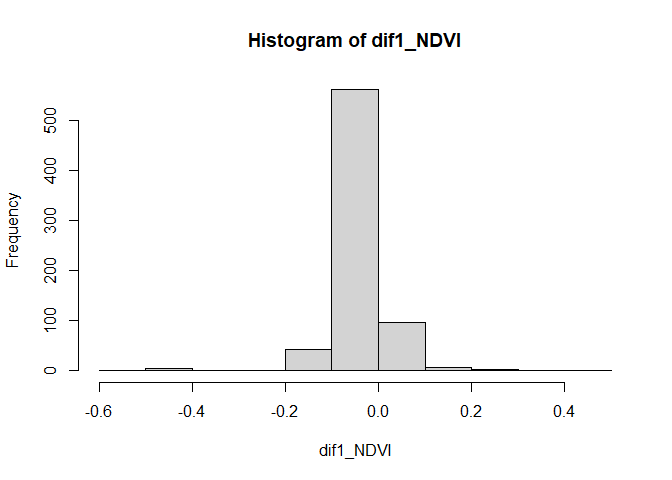<!-- -->

``` r
#Max Temp first Dif
hist(dif1_maxt) #normalish
```

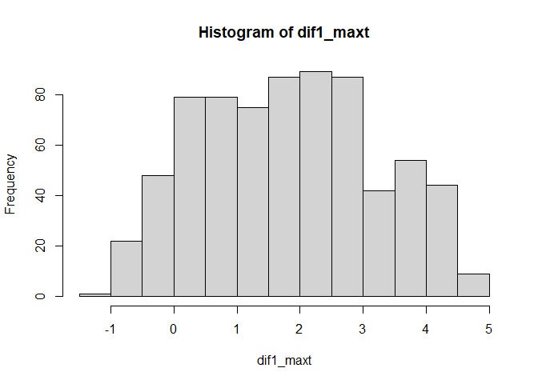<!-- -->

``` r
#Min Temperature first dif
hist(dif1_mint) #skewed
```

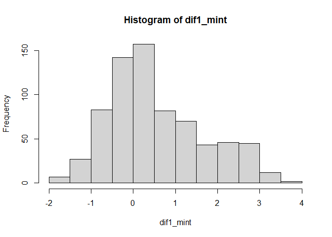<!-- -->

``` r
#Rain first dif
hist(dif1_rain) #normalish
```

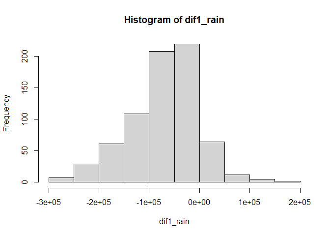<!-- -->

``` r
# Population first dif
hist(dif1_pop) #skewed
```

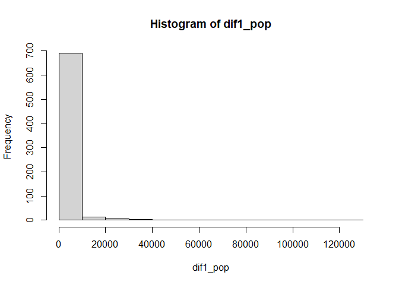<!-- -->

``` r
# Water Percentage first dif
hist(dif1_wat) #normalish
```

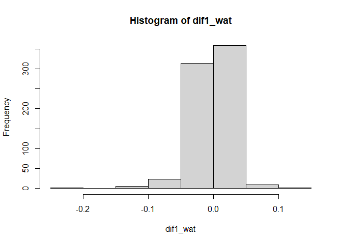<!-- -->

``` r
lab6_data$dif1_NDVI <- lab6_data$ndvi_20_med - lab6_data$ndvi_00_med
lab6_data$dif1_maxt <- lab6_data$maxtemp_20_med - lab6_data$maxtemp_00_med
lab6_data$dif1_mint <- lab6_data$mintemp_20_med - lab6_data$mintemp_00_med
lab6_data$dif1_rain <- lab6_data$rain_20_sum - lab6_data$rain_00_sum
lab6_data$dif1_pop <- lab6_data$pop_20 - lab6_data$pop_00
lab6_data$dif1_wat <- lab6_data$water_20_pct - lab6_data$water_00_pct

map_ndvi <- tm_shape(lab6_data) + # error correction - whole sf object needed to be passed in to tm_shape
  tm_borders() +  
  tm_fill("dif1_NDVI" , style = "jenks") #needed to specify the variable for the color, in this case "ndvi_20_med"

map_maxT <- tm_shape(lab6_data) + 
  tm_borders() +  
  tm_fill("dif1_maxt" , style = "jenks") 

map_minT <- tm_shape(lab6_data) + 
  tm_borders() +  
  tm_fill("dif1_mint" , style = "jenks")

map_rain <- tm_shape(lab6_data) + 
  tm_borders() +  
  tm_fill("dif1_rain" , style = "jenks")

map_pop <- tm_shape(lab6_data) + 
  tm_borders() +  
  tm_fill("dif1_pop" , style = "jenks")

map_wat <- tm_shape(lab6_data) + 
  tm_borders() +  
  tm_fill("dif1_wat" , style = "jenks")


tmap_arrange(map_ndvi, map_maxT, map_minT , map_rain, map_pop, map_wat )
```

    ## Variable(s) "dif1_NDVI" contains positive and negative values, so midpoint is set to 0. Set midpoint = NA to show the full spectrum of the color palette.

    ## Variable(s) "dif1_maxt" contains positive and negative values, so midpoint is set to 0. Set midpoint = NA to show the full spectrum of the color palette.

    ## Variable(s) "dif1_mint" contains positive and negative values, so midpoint is set to 0. Set midpoint = NA to show the full spectrum of the color palette.

    ## Variable(s) "dif1_rain" contains positive and negative values, so midpoint is set to 0. Set midpoint = NA to show the full spectrum of the color palette.

    ## Variable(s) "dif1_wat" contains positive and negative values, so midpoint is set to 0. Set midpoint = NA to show the full spectrum of the color palette.

    ## Variable(s) "dif1_NDVI" contains positive and negative values, so midpoint is set to 0. Set midpoint = NA to show the full spectrum of the color palette.

    ## Legend labels were too wide. The labels have been resized to 0.51, 0.51, 0.51, 0.53, 0.56. Increase legend.width (argument of tm_layout) to make the legend wider and therefore the labels larger.

    ## Variable(s) "dif1_maxt" contains positive and negative values, so midpoint is set to 0. Set midpoint = NA to show the full spectrum of the color palette.

    ## Some legend labels were too wide. These labels have been resized to 0.64. Increase legend.width (argument of tm_layout) to make the legend wider and therefore the labels larger.

    ## Variable(s) "dif1_mint" contains positive and negative values, so midpoint is set to 0. Set midpoint = NA to show the full spectrum of the color palette.

    ## Legend labels were too wide. The labels have been resized to 0.51, 0.53, 0.56, 0.56, 0.56. Increase legend.width (argument of tm_layout) to make the legend wider and therefore the labels larger.

    ## Variable(s) "dif1_rain" contains positive and negative values, so midpoint is set to 0. Set midpoint = NA to show the full spectrum of the color palette.

    ## Legend labels were too wide. The labels have been resized to 0.39, 0.39, 0.41, 0.46, 0.44. Increase legend.width (argument of tm_layout) to make the legend wider and therefore the labels larger.

    ## Some legend labels were too wide. These labels have been resized to 0.51, 0.48, 0.48, 0.44. Increase legend.width (argument of tm_layout) to make the legend wider and therefore the labels larger.

    ## Variable(s) "dif1_wat" contains positive and negative values, so midpoint is set to 0. Set midpoint = NA to show the full spectrum of the color palette.

    ## Legend labels were too wide. The labels have been resized to 0.51, 0.51, 0.51, 0.53, 0.56. Increase legend.width (argument of tm_layout) to make the legend wider and therefore the labels larger.

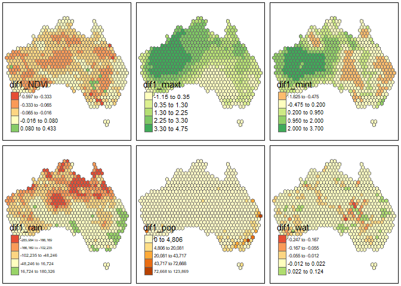<!-- -->

{summary: The results showed predominantly negative change (indicating
decrease over the time period 2000-2020) for NDVI, and rain. There were
patterns of primarily increase in Max Temperature, and increase in Min
temperature values concentrated accross western Australia. Population
showed no decreases over Australia, and there were notable increases in
population along the southeast coast. Percent water cover showed
increase in some areas and decrease in others but with no distinct
pattern.}

\#Option 2 The animal data included in this dataset is an example of
count data, and usually we would use a Poisson or similar model for that
purpose. Let’s try it with regular OLS regression though. Create two
regression models to assess how the counts of two different animals
(say, koalas and emus) are associated with at least three of the
environmental/climatological variables given above. Be sure to use the
same independent variables in each model. Interpret the results of each
model and then explain the importance of any differences in the model
coefficients between them, focusing on direction, magnitude, and
significance.
